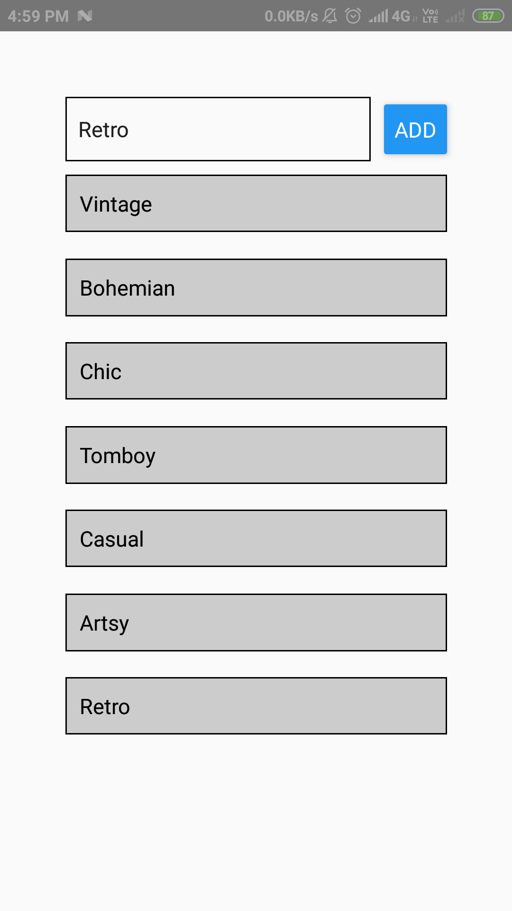
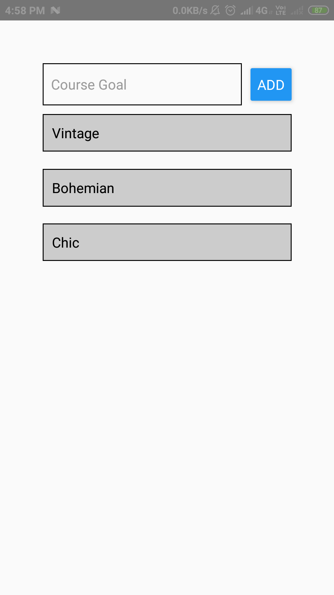

# React-native-base

If you are new to mobile development, the easiest way to get started is with Expo CLI. Expo is a set of tools built around React Native and, while it has many features, the most relevant feature for us right now is that it can get you writing a React Native app within minutes. You will only need a recent version of Node.js and a phone or emulator. If you'd like to try out React Native directly in your web browser before installing any tools.

## Implementation of React-native properties
- Styles and Layouts
- State and Events
- ScrollView
- Components and lists
- Model Overlay

 

